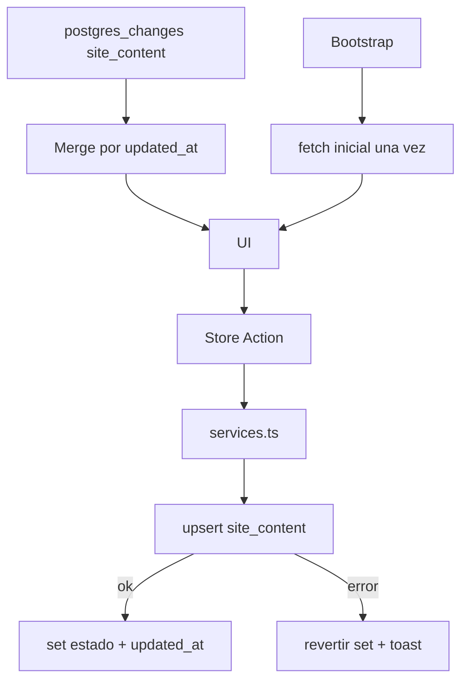

# Plan: Corrección Cloud-First sin localStorage en ReyGas

## 1. Diagnóstico (causa raíz)

El síntoma —"el valor cambia y luego vuelve al original al refrescar"— sin errores visibles de Supabase indica un problema de **lectura que pisa la escritura** y de **persistencia local que enmascara el estado real de la nube**.

Causas identificadas en el código:

1. **Persistencia local activa en Zustand**: [`app-store.ts`](src/lib/store/app-store.ts:2643) usa `persist` con `localStorage` y `partialize` que guarda `siteContent`, `technicians`, `workshopServices`, etc. Al montar la app, ese estado local antiguo se hidrata primero y "reaparece" aunque la nube tenga otro valor.
2. **`saveSupabaseSiteContent` no confirma éxito/error**: en [`services.ts`](src/lib/supabase/services.ts:49) los intentos de upsert caen en cascada (`onConflict: section_key` → `onConflict: key` → `update.or` → `insert`) y cualquier fallo se traga con `console.warn` sin propagar. La acción del store ya hizo `set()` local, por lo que la UI muestra el valor nuevo aunque la nube nunca lo aceptó.
3. **Re-sync que sobrescribe lo local**: [`supabase-sync-provider.tsx`](src/components/providers/supabase-sync-provider.tsx:29) ejecuta `syncFromSupabase()` al montar, al recuperar foco y cada 90s. `syncFromSupabase` reemplaza `siteContent` completo desde la nube, pisando cualquier cambio local cuyo guardado falló o aún no terminó.
4. **Doble fuente de verdad en `site_content`**: [`saveSupabaseSiteContent`](src/lib/supabase/services.ts:49) escribe tanto `section_key` como `key` y alterna el `onConflict`, lo que puede crear filas duplicadas o conflictos de PK no detectados.
5. **Ventana anti-mutación corta**: `markLocalMutation()` solo protege 3.5s–5s; los guardados async lentos o con reintento quedan desprotegidos y un heartbeat posterior reemplaza el dato.

## 2. Objetivo

- Eliminar `localStorage` como fuente de persistencia; la única fuente de verdad es Supabase.
- Toda escritura debe **confirmar** éxito en Supabase antes de considerarse persistida (o revertir la UI en caso de error).
- La lectura no debe pisar escrituras locales pendientes (protección por `updated_at` / last-write-wins).

## 3. Arquitectura objetivo

Reglas:
- **Sin `persist` / `localStorage`** para datos de dominio.
- **Escritura confirmada**: la acción llama al service, espera el resultado y solo actualiza el estado optimista tras éxito (o revierte).
- **Lectura protegida**: todo fetch/sync compara `updated_at` y solo aplica el valor si es más nuevo que el local, o si no hay cambios locales pendientes.
- **Realtime puntual**: los handlers de `postgres_changes` actualizan solo la fila/sección afectada, no un re-fetch completo.

## 4. Pasos de implementación

### 4.1 Eliminar persistencia local
- Quitar el wrapper `persist(...)` en [`app-store.ts`](src/lib/store/app-store.ts:655) y el objeto de configuración con `partialize`, `name: "reygas-app-storage"` y `storage`.
- Quitar la rehidratación por `storage` event en [`supabase-sync-provider.tsx`](src/components/providers/supabase-sync-provider.tsx:34).
- Verificar que `useAppStore.persist` no se use en ninguna otra parte (eliminar las referencias).
- Mantener solo sesión en memoria (no persistida) o, de requerirse, un flag `isAuthenticated` efímero.

### 4.2 Hacer determinístico `saveSupabaseSiteContent`
- Reescribir [`saveSupabaseSiteContent`](src/lib/supabase/services.ts:49) para:
  - Usar un único `onConflict: "section_key"` con `section_key = key` siempre.
  - Devolver `{ success: boolean; error?: string }` en lugar de tragar errores.
  - NO caer en cascada de `insert` ciego; si falla el upsert, reintentar una vez y luego reportar.
  - Actualizar `updated_at` explícitamente con `new Date().toISOString()`.
- Aplicar `section_key` como única clave; depurar el esquema [`supabase_schema.sql`](supabase_schema.sql:8) para que `section_key` sea la PK única y no exista ambigüedad con `key`.

### 4.3 Acciones del store con confirmación y rollback
- En [`updateSiteContent`](src/lib/store/app-store.ts:1242) y [`updateTheme`](src/lib/store/app-store.ts:1267):
  - Capturar el valor anterior.
  - Aplicar `set` optimista.
  - `await saveSupabaseSiteContent(...)`.
  - Si `success === false`: revertir con el valor anterior y notificar.
- Repetir el patrón en `updateAISettings`, `updateCorrelativeConfig`, `add/update/deleteWorkshopService`, y las acciones de inventario/órdenes/facturas que ya llaman services.
- Convertir estas acciones a `async` cuando corresponda, retornando el resultado de éxito.

### 4.4 Proteger las lecturas contra pisado
- Agregar a cada dominio un marcador `dirty` o `lastLocalMutation` por clave:
  - Antes de escribir, marcar la clave como pendiente (`markLocalMutation(key)`).
  - En `syncFromSupabase`, `syncServicesOnly`, `syncTechniciansOnly`, `syncInventoryOnly`, `syncCertificationsOnly` y `syncScheduleOnly`, ignorar el resultado si la clave local tiene una mutación pendiente reciente.
- Para `siteContent`, comparar `updated_at` remoto vs. local antes de reemplazar (last-write-wins).

### 4.5 Realtime puntual en CMS
- En [`supabase-sync-provider.tsx`](src/components/providers/supabase-sync-provider.tsx:76), el handler actual de `site_content` dispara `syncServicesOnly` y `syncTechniciansOnly`. Reemplazar por:
  - Handler que lee `payload.new` (fila actualizada) y actualiza SOLO la sección correspondiente en el store si el cambio no proviene del mismo cliente.
  - Evitar re-fetch completo de `site_content`.
- Para el resto de tablas (inventory, work_orders, invoices, etc.) mantener handlers puntuales existentes, pero con la protección de `updated_at`/dirty del punto 4.4.

### 4.6 Depuración del backend Supabase
- Confirmar en Supabase Dashboard que:
  - Existen todas las tablas y columnas usadas (`site_content`, `technicians`, `inventory_items`, `work_orders`, `invoices`, `vehicles`, `certifications`, `schedule_records`, `appointments`).
  - `site_content.section_key` es PK y no hay PK duplicada con `key`.
  - RLS permite upsert/update/delete con la anon key (política actual `FOR ALL USING (true)`).
- Verificar que no existan triggers o `updated_at` que sobrescriban.

### 4.7 Validación manual
- Pasos de QA:
  1. Modificar un texto del CMS en Configuración.
  2. Ver en Network que el upsert responde 2xx y no hay error.
  3. Refrescar la página: el valor debe persistir.
  4. Abrir Supabase Dashboard → `site_content` y confirmar la fila actualizada.
  5. Modificar desde una segunda pestaña y verificar que la primera se actualiza por Realtime sin recargar.

## 5. Archivos afectados

- [`src/lib/store/app-store.ts`](src/lib/store/app-store.ts) — quitar persist, acciones async con confirmación/rollback, protección de dirty keys.
- [`src/lib/supabase/services.ts`](src/lib/supabase/services.ts) — `saveSupabaseSiteContent` determinístico con retorno de éxito, `markLocalMutation` por clave.
- [`src/components/providers/supabase-sync-provider.tsx`](src/components/providers/supabase-sync-provider.tsx) — eliminar storage rehydrate, realtime puntual para site_content.
- [`supabase_schema.sql`](supabase_schema.sql) — confirmar/ajustar PK única de `site_content`.

## 6. Orden de ejecución recomendado

1. Depurar `site_content` en Supabase (PK, políticas).
2. Reescribir `saveSupabaseSiteContent` (retorno de éxito, upsert único).
3. Quitar persistencia local y rehidratación.
4. Convertir acciones a async con rollback.
5. Agregar protección de lecturas por `updated_at`/dirty.
6. Implementar realtime puntual.
7. QA manual completo.

## 7. Criterios de aceptación

- Ningún dato de dominio se lee de `localStorage`.
- Un cambio de valor sobrevive al refresco (F5) y a la recarga en otra pestaña.
- Una escritura fallida NO deja la UI en estado falso; revierte y notifica.
- La sincronización entre dispositivos ocurre por Realtime en tiempo real.
